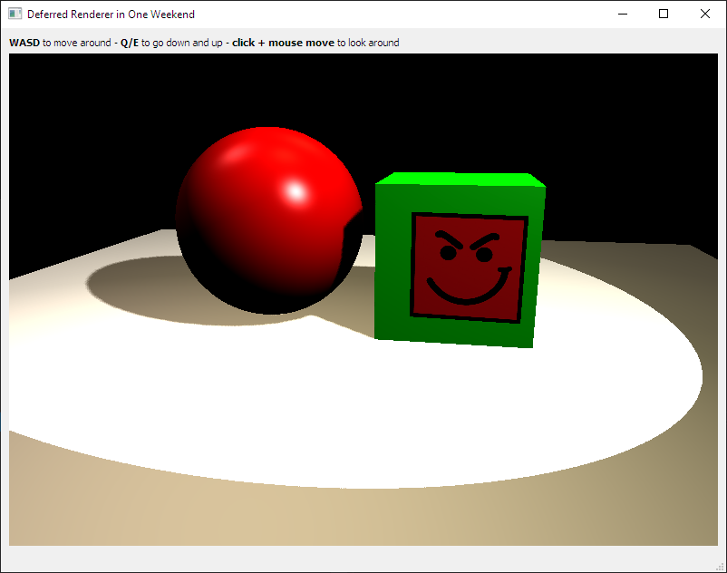

# Deferred Renderer In One Weekend

This is a simple **deferred renderer in OpenGL** done in one weekend.

Yes, the name comes from [Peter Shirley's Ray Tracing in One Weekend Book Series](https://github.com/RayTracing/raytracing.github.io), but by no means this is comparable. This is a *one-shot* project, meaning that I had to work on this as a speed run on a weekend without planning it and that's it.

It renders spheres, cubes, and planes with deferred Phong lighting. There are point lights and a spot light casting PCF shadows. Decal rendering has been implemented as well, that project a texture onto the GBuffer albedo.

## How to run
* Make sure you have Qt5+ installed
* Make sure you have openGL 4+ drivers
* Build the Visual Studio 2019 solution with *Cmake* by running the script *build.sh*
  * The solution will be in `build/rendererApp.sln`

## What I've used:
* CMake to build the project
* Visual Studio 16 2019 as IDE
* QtCreator 4.12 (based on Qt 5.14) for the main window UI
* Glad (from https://glad.dav1d.de/)
* GLM for vectors and matrices